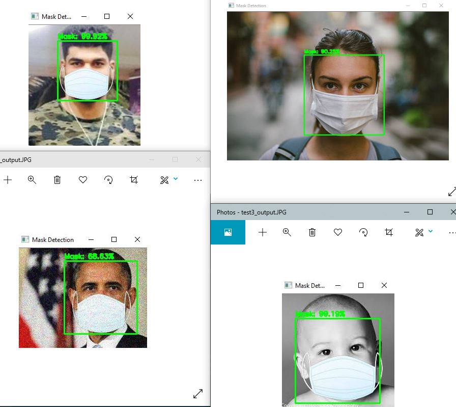
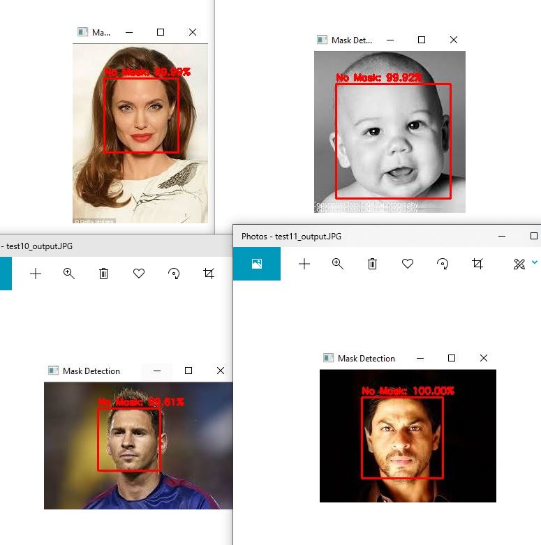

# Face-Mask-Detection-Keras
Implementing a face mask detector using Keras and OpenCV.

### Requirements:
* python3
* keras V2.4.3
* tensorflow V2.3.0
* numpy V1.18.5
* scikit-image V0.17.2
* opencv-python V4.3.0.36
* matplotlib V3.2.2
* imutils V0.5.3

### Steps to produce:
1. Train a *transfer learning* neural network to detect face masks.
2. Detect *face region of interests (ROIs)* from an input image using pre-trained [Haar Cascades classifier](https://opencv-python-tutroals.readthedocs.io/en/latest/py_tutorials/py_objdetect/py_face_detection/py_face_detection.html).
2. Run a prediction on these and evaluate and fine-tune hyperparmeters of the network.

### A Recipe for Training:
1. A Dataset
2. A loss function
3. A neural network architecture
4. An optimization method

### Dataset:
[Reference to Prajna Bhandary's Dataset:](https://github.com/prajnasb/observations/tree/master/experiements/data)

**1,376** images belonging to two classes:
* with_mask: 690 images
* without_mask: 686 images
* batch_size: 32 images
* train_test_split: 75%-25%

Applying [__data augmentation__](https://www.pyimagesearch.com/2019/07/08/keras-imagedatagenerator-and-data-augmentation/) to increase the generalizability of the model
while obtaining additional traditional data. 

### CNN architecture implemented in this repository:
Fine-tuning [**Inception V3**](https://keras.io/api/applications/inceptionv3/) network structure from keras applications:
> The goal of the inception module is to act as multi-level feature extractor by computing 1x1, 3x3, and 5x5 convolutions within the same module of the network.

> This process enables the network to learn both local features via smaller convolutions and abstracted features with larger convolutions.

Main model architecture:

1. Replace the head of a network with a new, randomly initialized head.
2. The layers in the body of the original network are frozen.
3. Train the new FC layers until a reasonable accuracy. (for 25 epochs)
4. Unfreeze the previous layers and train the entire model again. (for 10 epochs)

### Regularizers:
* SGD (Stochastic Gradient Descent)
* Adam (Adaptive Moment Estimation)

### Evaluations of the Trained Network:
[Training Process Log: Evaluated to 99% Accuracy Average](output/trainingEval.txt)

class | precision | recall  | f1-score |  support
------| --------- | ------- | -------- |  -------
with_mask    | 0.98 | 1.00 | 0.99 | 172
without_mask | 1.00 | 0.98 | 0.99 | 172

### Results of the Trained Network:

>

>

### Final Thoughts:
* **Inception V3** network might have been an over qualified arhictecture to fine-tune for this problem and dataset. Therefore, smaller epochs are used in my training to achieve satisfactory results.
* **Prevent overfitting** your model through regularizations techniques such as data augmentation and dropout layers.
* Always apply a **momentum and a decay** to your learning rate making your updates to your loss function adaptive which in turn increases generalization and classification accuracy.
* **Fine-tuning and feature extraction** works best with different kinds of problems. Therefore, try experimenting with both and become familiar with the transfer learning process.
* If working with a larger dataset, store the data to a binary format such as **HDF5** beforehand to prevent I/O bottlenecks.
* The **more practice** you have at training neural networks, monitoring the results and tuning the hyperparameters, the better you'll become at it.
* Evaluation results have shown that, my trained model works nicely with a single person images, but it has problems with an image with multiple people. My guess is that **Haar Cascades parameters need to be tuned more carefully** to properly detect faces initially before applying mask detection.
* Also, **train using your [GPU](https://www.youtube.com/watch?v=IubEtS2JAiY) to save time on your multiple trail of trainings**. With models that has deeper amount of layers, CPU bottlenecks could cost you several hours of training during the back-propagation process.
* Finally, it was a fun and a challenging project. I learned a lot and **wear your masks** :).

### References:
* [Deep Learning for Computer Vision with Python VOL1 & VOL2 by Dr.Adrian Rosebrock](https://www.pyimagesearch.com/deep-learning-computer-vision-python-book/)
* [Tutorial to the original post of Dr.Adrian Rosebrock](https://www.pyimagesearch.com/2020/05/04/covid-19-face-mask-detector-with-opencv-keras-tensorflow-and-deep-learning/)

